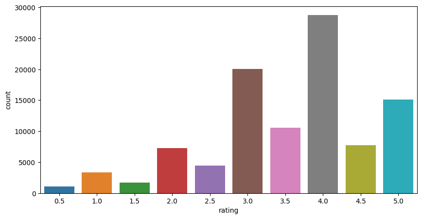
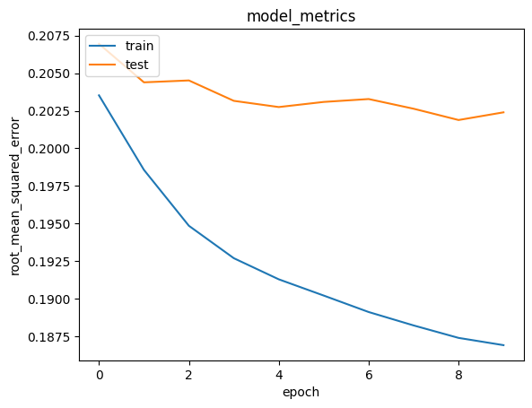

# Laporan Proyek Machine Learning - Paulus Lestyo Adhiatma

## Project Overview

Sistem rekomendasi film telah menjadi sebuah inovasi yang sangat penting dalam dunia hiburan digital. Di tengah melimpahnya pilihan film dan konten video yang tersedia, pengguna seringkali mengalami kesulitan dalam memilih film yang sesuai dengan kebutuhannya [1]. Untuk mengatasi masalah ini, sistem rekomendasi film telah muncul sebagai solusi yang efektif. Sistem rekomendasi merupakan program atau sistem penyaringan informasi yang menjadi solusi dalam masalah kelebihan informasi dengan cara menyaring sebagian informasi penting dari banyaknya informasi yang ada [2]. Dengan menggunakan teknik analisis data dan kecerdasan buatan (AI), sistem ini dapat memprediksi dan merekomendasikan film kepada pengguna berdasarkan berbagai faktor, termasuk sejarah penilaian pengguna, preferensi pribadi, genre film, dan informasi lainnya. Dengan adanya sistem rekomendasi, pengguna dapat menemukan film-film yang pengguna sukai dengan lebih mudah, meningkatkan pengalaman pengguna dalam mengeksplorasi dunia hiburan digital.

## Business Understanding

### Problem Statements

Menjelaskan pernyataan masalah:
- Bagaimana pengguna hiburan digital dapat lebih mudah memilih film yang sesuai dengan preferensi pengguna di tengah banyaknya pilihan film yang tersedia, dengan tujuan meningkatkan pengalaman pengguna dan retensi pelanggan?
- Bagaimana solusi yang efektif untuk mempertahankan kualitas rekomendasi dan meningkatkan penggunaan platform dalam proses pengelolaan dan penyaringan konten film dalam platform hiburan digital?

### Goals

Menjelaskan tujuan proyek yang menjawab pernyataan masalah:
- mengembangkan sistem rekomendasi film yang berdasarkan penilaian pengguna, serta data konten film. Sistem ini akan membantu pengguna menemukan film yang sesuai dengan preferensi, dan meningkatkan pengalaman pengguna.
- memperkenalkan solusi yang efisien dalam pengelolaan dan penyaringan konten film. meningkatkan kualitas rekomendasi film, mengoptimalkan penggunaan sumber daya, dan meningkatkan efisiensi dalam menyediakan konten berkualitas tinggi kepada pengguna.

### Solution statements
1. Content-Based Filtering:
- Pendekatan pertama yang akan digunakan adalah Content-Based Filtering. Dalam pendekatan ini, sistem akan menganalisis atribut dan fitur dari film-film yang ada, seperti genre, aktor, sutradara, dan deskripsi, untuk memahami kontennya. Kemudian, sistem akan memberikan rekomendasi kepada pengguna berdasarkan preferensi pribadi pengguna, yang akan dikumpulkan dari riwayat penilaian pengguna terhadap film-film sebelumnya. Dengan demikian, pengguna akan menerima rekomendasi film yang serupa dengan film-film yang telah pengguna nikmati sebelumnya.

2. Collaborative Filtering:
- Dalam pendekatan ini, sistem akan memanfaatkan data histori penilaian dari banyak pengguna untuk mengidentifikasi pola dan keterkaitan antara pengguna dengan preferensi serupa. Misalnya, jika dua pengguna A dan B memberikan penilaian yang mirip terhadap sejumlah film, maka sistem akan merekomendasikan film yang dinikmati oleh pengguna B kepada pengguna A, dan sebaliknya. Collaborative Filtering dapat digunakan untuk memberikan rekomendasi yang lebih personal dan mempertimbangkan preferensi yang mungkin tidak terlihat dalam analisis Content-Based Filtering.

## Data Understanding

Dataset yang digunakan yaitu memanfaatkan public dataset dari [snehal1409/movielens](https://www.kaggle.com/datasets/snehal1409/movielens/data) yang berisi dataaset terkait movies beserta rating dari user dan terdiri dari beberapa file. Namun pada proyek ini hanya menggunakan 2 file yaitu:

1. movies.csv

| movieId |                   title                  |                             genres                            |
|---------|-----------------------------------------|--------------------------------------------------------------|
|    1    |         Toy Story (1995)                | Adventure|Animation|Children|Comedy|Fantasy                    |
|    2    |         Jumanji (1995)                  | Adventure|Children|Fantasy                                   |
|    3    |         Grumpier Old Men (1995)         | Comedy|Romance                                              |
|    4    |         Waiting to Exhale (1995)        | Comedy|Drama|Romance                                        |
|    5    |         Father of the Bride Part II (1995) | Comedy                                                     |
Tabel 1. Contoh isi dataset movies

Terdapat beberapa variabel/kolom pada movies.csv. berikut penjelasan tiap kolomnya:
- movieId: Ini adalah ID unik yang digunakan untuk mengidentifikasi setiap film dalam dataset. Setiap film memiliki movieId yang berbeda.
- title: Kolom ini berisi judul film. Ini adalah nama resmi dari film tersebut.
- genres: Ini adalah kolom yang berisi informasi tentang genre-genre film. Film dapat memiliki beberapa genre, dan genre-genre ini terpisahkan oleh tanda "|"

2. ratings.csv

| index | userId | movieId | rating | timestamp  |
|-------|--------|---------|--------|------------|
|   0   |   1    |   31    |  2.5   | 1260759144 |
|   1   |   1    |  1029   |  3.0   | 1260759179 |
|   2   |   1    |  1061   |  3.0   | 1260759182 |
|   3   |   1    |  1129   |  2.0   | 1260759185 |
|   4   |   1    |  1172   |  4.0   | 1260759205 |
Tabel 2. Contoh isi dataset ratings

Pada ratings.csv juga terdapat beberapa kolom diantaranya:
- index: Indeks baris data.
- userId: ID pengguna yang memberikan penilaian.
- movieId: ID unik untuk mengidentifikasi film.
- rating: Penilaian yang diberikan oleh pengguna terhadap film (dalam format angka).
- timestamp: Waktu ketika penilaian diberikan oleh pengguna (dalam format waktu UNIX).

Pada rating yang diberikan oleh user sebanyak total 9066 rating. terlihat distribusi rating yang diberikan yaitu sebagai berikut.

Gambar 1. Distribusi rating film

Pada Gambar 1. terlihat bahwa user banyak memberikan rating dengan nilai 4 dan paling sedikit 0.5. Selain itu, distribusi rating ini cenderung left-skewed

## Data Preparation

Data preparation terbagi menjadi 2 yaitu untuk Content-Based Filtering dan Collaborative Filltering.
1. Data Preparation for Content-Based Filtering

Untuk Content-Based Filtering, langkah-langkah pemrosesan data yang dilakukan melibatkan ekstraksi informasi penting dari dataset movies. Proses ini mencakup:

1.  Pemisahan Genre: Kolom "genres" pada dataset movies dipisahkan menjadi array genre yang memudahkan pengolahan data. Berikut contohnya.

| Before                                            | After                                             |
|---------------------------------------------------|---------------------------------------------------|
| "Adventure\|Animation\|Children\|Comedy\|Fantasy" | "[Adventure, Animation, Children, Comedy, Fantasy]" |
| "Adventure\|Children\|Fantasy"                    | "[Adventure, Children, Fantasy]"                    |
Tabel 3. Data preparations genres movie

Terlihat pada Tabel 3. data yang memiliki genres "Adventure|Animation|Children|Comedy|Fantasy" akan diubah menjadi daftar genre: "[Adventure, Animation, Children, Comedy, Fantasy]". Dan kolom genres dengan teks "Adventure|Children|Fantasy" akan diubah menjadi [Adventure, Children, Fantasy]
Hal ini dilakukan untuk memudahkan dalam proses selanjutnya yaitu representasi numerik

2. Representasi Numerik: Kemudian, menggunakan pendekatan TF-IDF (Term Frequency-Inverse Document Frequency) untuk mengubah daftar genre menjadi representasi numerik. Setiap genre akan memiliki bobot berdasarkan seberapa sering genre tersebut muncul dalam dataset dan seberapa umumnya genre tersebut dalam dataset. Dengan representasi numerik ini, dapat mengukur kemiripan antara film berdasarkan genre.

|movieId|mystery|sci|listed|adventure|imax|horror|western|film|noir|fi|romance|drama|crime|action|comedy|genres|children|fantasy|war|documentary|
|---|---|---|---|---|---|---|---|---|---|---|---|---|---|---|---|---|---|---|---|---|
|7095|0\.0|0\.0|0\.0|0\.0|0\.0|0\.0|0\.0|0\.0|0\.0|0\.0|0\.0|1\.0|0\.0|0\.0|0\.0|0\.0|0\.0|0\.0|0\.0|0\.0|
|2888|0\.0|0\.0|0\.0|0\.0|0\.0|0\.0|0\.0|0\.0|0\.0|0\.0|0\.8095879507326377|0\.0|0\.0|0\.0|0\.5869985945711695|0\.0|0\.0|0\.0|0\.0|0\.0|
|7272|0\.0|0\.0|0\.0|0\.0|0\.0|0\.0|0\.0|0\.0|0\.0|0\.0|0\.0|0\.38441464922392016|0\.6892477618471474|0\.6141358972171783|0\.0|0\.0|0\.0|0\.0|0\.0|0\.0|
|99741|0\.0|0\.0|0\.0|0\.0|0\.0|0\.0|0\.0|0\.0|0\.0|0\.0|0\.0|0\.0|0\.0|0\.0|0\.0|0\.0|0\.0|0\.0|0\.0|0\.0|
|2939|0\.0|0\.0|0\.0|0\.0|0\.0|0\.0|0\.0|0\.0|0\.0|0\.0|0\.0|0\.5463862962109709|0\.0|0\.0|0\.0|0\.0|0\.0|0\.0|0\.0|0\.0|
|3028|0\.0|0\.0|0\.0|0\.0|0\.0|0\.0|0\.0|0\.0|0\.0|0\.0|0\.0|0\.0|0\.0|0\.0|1\.0|0\.0|0\.0|0\.0|0\.0|0\.0|
|1417|0\.0|0\.0|0\.0|0\.0|0\.0|0\.0|0\.0|0\.0|0\.0|0\.0|0\.0|1\.0|0\.0|0\.0|0\.0|0\.0|0\.0|0\.0|0\.0|0\.0|
|7484|0\.0|0\.0|0\.0|0\.0|0\.0|0\.0|0\.0|0\.0|0\.0|0\.0|0\.0|0\.0|0\.0|0\.0|0\.0|0\.0|0\.0|0\.0|0\.0|1\.0|
|96821|0\.0|0\.0|0\.0|0\.0|0\.0|0\.0|0\.0|0\.0|0\.0|0\.0|0\.8476385006273186|0\.530574191093264|0\.0|0\.0|0\.0|0\.0|0\.0|0\.0|0\.0|0\.0|
|6162|0\.0|0\.0|0\.0|0\.8723245495735925|0\.0|0\.0|0\.0|0\.0|0\.0|0\.0|0\.0|0\.4889272749716761|0\.0|0\.0|0\.0|0\.0|0\.0|0\.0|0\.0|0\.0|
Tabel 4. Contoh representasi numerik movie berdasarkan genres dengan TF-IDF

Contoh representasi numerik pada Tabel 4 adalah hasil dari langkah-langkah ini, di mana setiap film memiliki vektor yang mencerminkan bobot setiap genre. Dengan demikian, film dengan nilai-nilai yang lebih tinggi dalam vektor yang sama cenderung memiliki genre yang serupa.

2. Data Preparation for Collaborative Filtering

1. Pemetaan user dan movie: Data preparation pada Collaborative Filtering dilakukan encoded/ pemetaan untuk user dan movie agar mudah merujuk pada pengguna dan item dalam bentuk angka, yang lebih efisien dalam perhitungan rekomendasi collaborative filtering

|index|userId|movieId|rating|timestamp|title|user|movie|
|---|---|---|---|---|---|---|---|
|19090|655|1291|5\.0|1470071173|Indiana Jones and the Last Crusade \(1989\)|471|202|
|99678|624|91873|1\.5|1371302167|Joyful Noise \(2012\)|125|8745|
|18455|56|1270|4\.0|1473792749|Back to the Future \(1985\)|129|197|
|35755|577|4896|4\.5|1111475690|Harry Potter and the Sorcerer's Stone \(a\.k\.a\. Harry Potter and the Philosopher's Stone\) \(2001\)|71|478|
|66536|157|85414|3\.5|1320684703|Source Code \(2011\)|280|1668|
|58156|452|5013|4\.0|1067732187|Gosford Park \(2001\)|25|1226|
|45934|457|1092|2\.5|1471386305|Basic Instinct \(1992\)|26|750|
|67241|352|97913|4\.0|1420521882|Wreck-It Ralph \(2012\)|299|1749|
|84837|509|3672|2\.0|978937742|Benji \(1974\)|93|3559|
|72699|514|1389|2\.0|853894850|Jaws 3-D \(1983\)|63|2204|
|68998|265|942|4\.0|960056420|Laura \(1944\)|162|1952|
|57406|165|4623|2\.5|1111610270|Major League \(1989\)|13|1183|
Tabel 5. Contoh data setelah dilakukan pemetaan user dan movie

2. Split Dataset: Setelah dilakukan pemetaan berikutnya dataset dibagi menjadi 2 bagian yaitu training dan validation dimana pembagiannya 8:2.
- Data training digunakan untuk melatih model untuk memprediksi nilai rating dari user kepada movie tertentu
- Data validation digunakan untuk menguji model dalam memprediksi nilai rating dari user kepada movie tertentu

Prediksi dari model tersebut nantinya akan digunakan sebagai acuan film/movie rekomendasi bagi user tertentu.

## Modeling
### Cara kerja Algoritma

- Content-Based Filtering: Algoritma ini bekerja dengan menganalisis atribut dan fitur dari film, seperti genre, aktor, sutradara, dan deskripsi. Pengguna kemudian diberikan rekomendasi berdasarkan preferensi pribadi yang dikumpulkan dari riwayat penilaian pengguna terhadap film-film sebelumnya. Pengguna akan menerima rekomendasi film dengan kemiripan genre atau atribut yang tinggi dengan film yang sudah pengguna nikmati.
- Collaborative Filtering: Algoritma ini memanfaatkan data histori penilaian dari banyak pengguna untuk mengidentifikasi pola dan keterkaitan antara pengguna dengan preferensi serupa. Model memprediksi rating yang mungkin diberikan oleh pengguna untuk film tertentu berdasarkan kesamaan preferensi dengan pengguna lain yang memiliki pola penilaian serupa.

### Tahap Modeling
Seperti pada tujuan awal dimana akan dilakukan 2 algoritma untuk rekomendasi film yaitu Cotent Based Filtering dan Collaborative Filtering berikut tahapan yang dilakukan dalam proses pembuatan model.

1. Cotent Based Filtering

Pada Cotent Based Filtering model yang dibuat cenderung lebih mudah dan tanpa melakukan training. Similarity movie/ film satu dengan lainnya dapat dilakukan dengan memanfaatkan TF-IDF yang telah dibuat dan fungsi cosine_similarity dari sklearn.

Seperti misalnya film dengan movieId 1 dengan judul "Toy Story (1995)" memiliki genre "[Adventure, Animation, Children, Comedy, Fantasy]" akan direkomendasikan film sebagai berikut:

|index|movieId|title|genres|
|---|---|---|---|
|0|91355|Asterix and the Vikings \(Astérix et les Vikings\) \(2006\)|Adventure,Animation,Children,Comedy,Fantasy|
|1|4016|Emperor's New Groove, The \(2000\)|Adventure,Animation,Children,Comedy,Fantasy|
|2|4886|Monsters, Inc\. \(2001\)|Adventure,Animation,Children,Comedy,Fantasy|
|3|3114|Toy Story 2 \(1999\)|Adventure,Animation,Children,Comedy,Fantasy|
|4|3754|Adventures of Rocky and Bullwinkle, The \(2000\)|Adventure,Animation,Children,Comedy,Fantasy|
Tabel 6. Rekomendasi dari movieId 1

Dari tabel 6. terlihat bahwa film yang direkomendasikan merupakan film dengan genre yang sama dengan film movieId yang berupa Adventure, Animation, Children, Comedy, Fantasy. 

2. Collaborative Filtering

Pada pembuatan model Collaborative Filtering perlu dilakukan proses training karena model akan memprediksi rating movie dari user tertentu sesuai dengan pola data training.
Dataset yang telah dipetakan dan dibagi menjadi data training dan validation kemudian akan dimanfaatkan sebagaikan pelatihan model.

Arsitektur model Collaborative Filtering yang digunakan terdiri dari beberapa layer:

- Input Layer: Layer pertama adalah input layer yang menerima data dalam bentuk ID pengguna (userId) dan ID film (movieId).
- Embedding Layer: Layer ini digunakan untuk mengubah ID pengguna dan ID film menjadi vektor representasi yang dipelajari oleh model.
- Dot Product Layer: Layer ini melakukan perkalian titik antara vektor representasi pengguna dan film untuk memprediksi nilai rating.
- Output Layer: Output layer menghasilkan prediksi nilai rating.

Model Collaborative Filtering menggunakan fungsi kerugian Binary Cross-Entropy dan optimizer Adam. Model ini di-train dengan 10 epoch dan ukuran batch tertentu. Hasil pelatihan dianalisis lebih lanjut dalam bagian Evaluasi.

Dengan memanfaatkan library Keras model dibuat dengan beberapa konfigurasi seperti :
- lossess BinaryCrossentropy: Ini digunakan untuk mengukur sejauh mana prediksi model cocok dengan target aktual.
- optimizers Adam: salah satu algoritma optimasi yang sering digunakan dalam pelatihan jaringan saraf tiruan untuk membantu mempercepat konvergensi model dan menghindari terjebak dalam minimum lokal.
- metrics RootMeanSquaredError (RMSE) : menghitung akar kuadrat dari rata-rata dari selisih kuadrat antara prediksi dan nilai target untuk mengukur seberapa dekat prediksi model dengan nilai target sebenarnya

Setelah konfigurasi dilakukan, kemudian dijalankan proses training dengan pengulangan/ epochs sebanyak 10x.
Setelah proses training, model dapat melakukan prediksi rating movie dari user tertentu yang hal ini digunakan sebagai acuan rekomendasi film kepada pengguna.

| movie with high ratings from user                              | Top 10 movie recommendation                               |
|---------------------------------------------------------------|------------------------------------------------------------|
| Trainspotting (1996) : ['Comedy', 'Crime', 'Drama']           | Godfather, The (1972) : ['Crime', 'Drama']                 |
| Raising Arizona (1987) : ['Comedy']                            | Roman Holiday (1953) : ['Comedy', 'Drama', 'Romance']       |
| First Strike (Police Story 4: First Strike) (1996) : ['Action', 'Adventure', 'Comedy', 'Thriller'] | Gone with the Wind (1939) : ['Drama', 'Romance', 'War'] |
| Grosse Pointe Blank (1997) : ['Comedy', 'Crime', 'Romance']    | Sunset Blvd. (a.k.a. Sunset Boulevard) (1950) : ['Drama', 'Film-Noir', 'Romance'] |
| Matrix, The (1999) : ['Action', 'Sci-Fi', 'Thriller']          | Citizen Kane (1941) : ['Drama', 'Mystery']                |
|---------------------------------------------------------------| All About Eve (1950) : ['Drama']                           |
|                                                               | African Queen, The (1951) : ['Adventure', 'Comedy', 'Romance', 'War'] |
|                                                               | Producers, The (1968) : ['Comedy']                         |
|                                                               | Happiness (1998) : ['Comedy', 'Drama']                     |
|                                                               | American History X (1998) : ['Crime', 'Drama']             |
Tabel 7. Rekomendasi Collaborative Filtering untuk user 408

Pada tabel 7. terlihat bahwa contoh user 408 yang telah melakukan rating film dengan angka tinggi (disukai) akan diberikan rekomendasi film yang sesuai dengan penghitungan hubungan antara pengguna dan movie yang telah dipelajari model saat proses training.

Dari 2 algoritma sistem rekomendasi yang telah dibuat dapat diketahui kelebihan dan kekurangan masing-masing algoritma yaitu:
1. Content Based Filtering

Kelebihan:
- Content-based filtering dapat memberikan rekomendasi yang sangat personal karena berdasarkan pada preferensi individu pengguna.
- Memungkinkan sistem untuk memahami atribut item dan menghasilkan rekomendasi yang lebih relevan berdasarkan fitur-fitur seperti genre, aktor, atau kata kunci.
- Cocok untuk produk atau item yang memiliki atribut atau fitur yang dapat dijelaskan dengan baik, seperti film, buku, atau produk e-commerce.

Kekurangan:
- Tidak efektif dalam menemukan item yang sangat berbeda dari preferensi sebelumnya pengguna karena bergantung pada atribut yang telah dikenal.
- Tidak efektif dalam menangkap preferensi yang mungkin lebih kompleks atau berubah seiring waktu.
-  Dapat menghasilkan rekomendasi yang terlalu mirip dengan preferensi sebelumnya dan mengabaikan keragaman.

2. Collaborative Filtering

Kelebihan:
- Dapat menemukan item yang tidak diketahui sebelumnya oleh pengguna, berdasarkan kesamaan preferensi dengan pengguna lain.
- Dapat menangkap preferensi yang lebih kompleks, bahkan jika atribut item tidak dikenal.
- Dapat digunakan untuk dataset besar dan cocok untuk berbagai jenis item.

Kekurangan:
- Kesulitan dalam memberikan rekomendasi untuk pengguna baru atau item baru yang tidak memiliki data historis.
- Bergantung pada data historis interaksi pengguna dengan item, sehingga dapat memiliki keterbatasan jika data kurang.
- Dapat menghasilkan filter bubble di mana pengguna hanya melihat rekomendasi yang mirip dengan preferensi sebelumnya, mengabaikan variasi.

## Evaluation
### Evaluation for Content Based Filtering
Evaluasi yang dapat dilakukan pada algoritma Cotent Based Filtering yaitu dengan menghitung precision secara manual.

Seperti yang sudah disajikan pada tabel 6 dimana model merekomendasikan movie yang mirip dengan movie dengan id 1. Terlihat bahwa 5 rekomendasi yang disajikan sesuai / relevan dengan movie yang dipilih.
Adventure,Animation,Children,Comedy,Fantasy adalah genre yang dimiliki oleh movieId 1 dan sistem rekomendasi juga memberikan 5 film dengan genre yang sesuai / relevan yaitu Adventure,Animation,Children,Comedy,Fantasy.

Jadi dapat disimpulkan bahwa Cotent Based Filtering model ini memiliki Precision = 5/5 atau 100%

### Evaluation for Collaborative Filtering

Gambar 3. Visualisasi metrik training dan test Collaborative Filtering

Dalam pelatihan model collaborative filtering, menggunakan dua metrik evaluasi:
1. Loss (Loss Function): Nilai loss atau fungsi kerugian adalah ukuran sejauh mana model cocok dengan data pelatihan. Nilai loss ini cenderung berkurang seiring dengan berjalannya epoch. Pada akhir pelatihan (epoch 10), loss mencapai sekitar 0.5846.
2. Root Mean Squared Error (RMSE): RMSE adalah metrik yang mengukur seberapa dekat prediksi model dengan nilai rating yang sebenarnya. Pada akhir pelatihan (epoch 10), RMSE mencapai sekitar 0.1869 untuk data pelatihan dan sekitar 0.2024 untuk data validasi.

Dari grafik Gambar 3. menunjukkan model cenderung mengalami overfitting dikarenakan nilai RMSE pada training mengalami penurunan dengan cepat sedangkan pada data test/validation tidak demikian dan justru naik. Overfitting ini dapat terjadi dikarenakan model mempelajari data pelatihan dengan sangat baik dan mungkin telah menangkap detail-detail kecil atau noise dalam data tersebut. Model tersebut menjadi terlalu kompleks sehingga dapat dengan mudah mengingat data pelatihan, tetapi tidak dapat menggeneralisasi dengan baik ke data yang tidak pernah dilihat sebelumnya, seperti data validasi atau pengujian.

Permasalahan seperti overfitting ini dapat diatasi dengan beberapa cara seperti penyederhanaan model, regularisasi, validasi tambahan, optimasi hyperparameter dan sebagainya.

## Daftar Pustaka

[1]	S. Sari and D. Tri Hendra, “Aplikasi Rekomendasi Film menggunakan Pendekatan Collaborative Filtering dan Euclidean Distance sebagai Ukuran kemiripan Rating,” Semin. Nas. Teknol. Inf. dan Komun. Terap., vol. 1, no. 1, pp. 135–140, 2015. 

[2]	M. Fajriansyah, P. P. Adikara, and A. W. Widodo, “Sistem Rekomendasi Film Menggunakan Metode Content Based Filtering,” J. Pengemb. Teknol. Inf. dan Ilmu Komput., vol. 5, no. 6, pp. 2188–2199, 2021, [Online]. Available: http://e-journal.uajy.ac.id/20600/