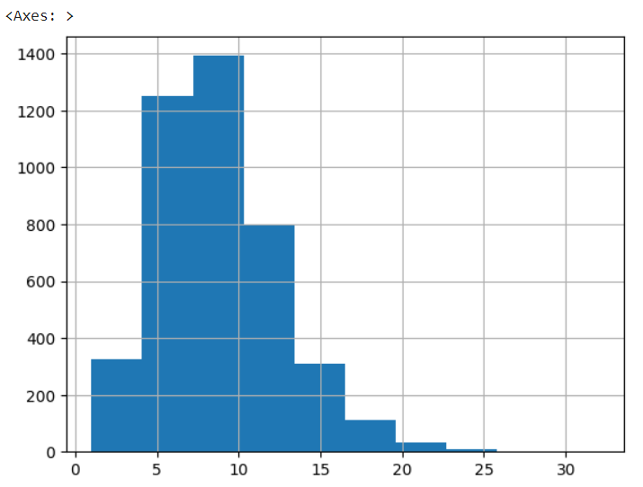

# Laporan Proyek Machine Learning - Paulus Lestyo Adhiatma

## Domain Proyek

Perkembangan teknologi yang semakin pesat pada era ini menjadikan mudahnya akses informasi yang didapatkan melalui internet. Namun, dibalik kelebihan tersebut tindakan persebaran berita bohong (hoax) yang dilakukan oknum tidak bertanggung jawab juga semakin meningkat. Pada bulan Agustus 2018 sampai April 2019 total temuan isu hoax sebanyak 1731 isu yang disebarkan melalui media sosial [1]. Selain itu Kominfo Pada bulan Mei 2021 juga melaporkan temuan isu hoax sebanyak 1.606 dan pengajuan take down hoax di media sebanyak 3.475 (Kominfo dalam Pangestu & Saragih, 2023). Dampak adanya berita bohong (hoax) diantaranya sulit membedakan berita hoax dan asli, mudah terprovokasi dan mudah membenci yang mencakup bidang ekonomi, kesehata, hingga politik [3].
Contoh dampak dari berita palsu meliputi:

- Pengaruh pada Kebijakan Publik: Berita palsu dapat memengaruhi kebijakan pemerintah dan tindakan masyarakat, terutama dalam situasi krisis seperti pandemi COVID-19. Keputusan yang salah dapat memiliki konsekuensi serius.
- Pembelahan Sosial: Berita palsu dapat memicu pembelahan sosial, karena masyarakat dapat dibagi berdasarkan keyakinan palsu yang diterima.
- Kekhawatiran Terhadap Kesehatan: Pada masa pandemi, berita palsu terkait pengobatan palsu atau vaksin palsu dapat membahayakan kesehatan masyarakat.

Teknologi NLP dapat melakukan pemantauan, analisis, dan deteksi otomatis pada teks dengan melakukan pelatihan suatu model untuk mengenali pola tertentu. Dengan bantuan teknologi NLP, upaya-upaya untuk mengatasi persebaran hoax dapat menjadi lebih efektif, cepat, dan akurat.

## Business Understanding

### Problem Statements

Menjelaskan pernyataan masalah latar belakang:
- Bagaimana implementasi NLP untuk mengidentifikasi berita hoax di internet?
- Bagaimana perbandingan performa antara Machine Learning SVM dengan Deep Learning dengan BERT? 

Informasi tambahan tentang mengapa pengidentifikasi berita hoax di internet menjadi masalah yang signifikan:

-  Dampak Sosial: Berita palsu dapat memicu perdebatan dan ketidakpercayaan di masyarakat, yang pada gilirannya dapat memengaruhi stabilitas sosial dan politik.
- Jangkauan Luas: Internet memungkinkan berita palsu menyebar dengan cepat ke berbagai lapisan masyarakat, sehingga dampaknya lebih besar.
- Keterbatasan Manusia: Manusia sulit untuk secara efisien memeriksa semua informasi yang mereka temui di internet, dan inilah alasan mengapa teknologi NLP sangat diperlukan.

### Goals

Menjelaskan tujuan dari pernyataan masalah:
- Untuk mengetahui implementasi NLP untuk mengidentifikasi berita hoax di internet?
- Untuk mendapatkan model terbaik berdasarkan perbandingan performa model

## Data Understanding

|   ID   | label |   tanggal  |                judul                |                   narasi                   | nama file gambar |
|--------|-------|------------|-------------------------------------|--------------------------------------------|------------------|
|   0    |   71  | 17-Aug-20  | Pemakaian Masker Menyebabkan Penyakit Legionna... | A caller to a radio talk show recently shared... |     71.jpg      |
|   1    |  461  | 17-Jul-20  | Instruksi Gubernur Jateng tentang penilangan ... | Yth.Seluruh Anggota Grup Sesuai Instruksi Gube... |     461.png     |
|   2    |  495  | 13-Jul-20  | Foto Jim Rohn: Jokowi adalah presiden terbaik ... | Jokowi adalah presiden terbaik dlm sejarah ban... |     495.png     |
|   3    |  550  |  8-Jul-20  | ini bukan politik, tapi kenyataan Pak Jokowi b... | Maaf Mas2 dan Mbak2, ini bukan politik, tapi k... |     550.png     |
|   4    |  681  | 24-Jun-20  | Foto Kadrun kalo lihat foto ini panas dingin  | Kadrun kalo lihat foto ini panas dingin . .   |     681.jpg     |
Tabel 1. Contoh Isi Dataset

Data yang digunakan pada proyek ini adalah [muhammadghazimuharam/indonesiafalsenews](https://www.kaggle.com/datasets/muhammadghazimuharam/indonesiafalsenews) yang merupakan data terkait informasi news/berita yang tersebar di internet khususnya di indonesia. 
Beberapa aspek kualitas data yang diperhatikan adalah:

- Keberagaman Sumber Data: Data berasal dari berbagai sumber, yang dapat mencerminkan beragam perspektif.
- Keakuratan Label: Label berita (hoax atau bukan hoax) harus diandalkan dan diverifikasi agar model dapat belajar dengan baik.
- Potensi Bias: Perlu diperhatikan adanya potensi bias dalam dataset yang dapat memengaruhi kinerja model.

Contoh data yang mencerminkan kesulitan tugas ini dapat ditemukan dalam berita tertentu yang memiliki judul yang ambigu atau narasi yang dirancang dengan baik untuk menyesatkan pembaca.

Kolom data ini diantaranya: 
- label: merupakan label dari berita yang bernilai 1 (hoax) dan 0 (berita benar), 
- tanggal: merupakan tanggal dari berita diterbitkan di internet, 
- judul: merupakan judul dari berita, 
- narasi: merupakan teks atau deskripsi dari berita.

kolom yang digunakan dari proyek ini hanya label dan judul. Berikut analisis yang dilakukan:
- Data dengan label 1 lebih banyak daripada label 0. Hal ini akan mempengaruhi model dalam melakukan klasifikasi

Gambar 1. Distribusi label dataset

- distribusi panjang karakter dan panjang kata tiap judul cenderung right skewness

Gambar 2. Distribusi panjang karakter tiap teks pada judul

Gambar 3. Distribusi panjang kata tiap teks pada judul

- Kata dan pasangan kata yang sering muncul cenderung berhubungan dengan pemerintahan dan covid 19

Gambar 4. Kata yang sering muncul pada kolom judul

Gambar 5. Pasangan 4 kata yang sering muncul pada kolom judul

## Data Preparation
### Pre-processing & text cleaning
Langkah-langkah pemrosesan data diperlukan untuk membersihkan dan mempersiapkan data untuk analisis. Ini termasuk mengubah teks menjadi huruf kecil, menghapus tanda baca dan karakter khusus, dan menghilangkan duplikasi.

Contoh Pre-processing:

| Sebelum                                                                                                                             | Sesudah |
|-------------------------------------------------------------------------------------------------------------------------------------|---------|
| Instruksi Gubernur Jateng tentang penilangan  bagi yg tidak bermasker di muka umum Rp.150.000 menggunakan e-tilang Via apps PIKOBAR | instruksi gubernur jateng tentang penilangan bagi yg tidak bermasker di muka umum rp 150 000 menggunakan tilang via apps pikobar   |
Tabel 2. Contoh sebelum dan sesudah dilakukan pre-processing

Melakukan pembersihan teks dengan melakukan lower_case, menghapus tanda baca dan special character.
Proses tersebut untuk menghilangkan noise dan duplikasi 

### Tokenization
Tokenisasi beserta menghapus stopwords atau kata yang tidak terlalu penting
Tokenisasi dilakukan agar model dapat mengenali teks dan menemukan pola yang ada

## Modeling
Dalam proyek ini, kami menggunakan dua model: Machine Learning SVM dan Deep Learning BERT.

Pemilihan Model
SVM dipilih karena kemampuannya untuk menemukan hyperplane terbaik dalam ruang berdimensi-N untuk pemisahan data. Namun, SVM memerlukan pre-processing data yang baik.

BERT dipilih karena kemampuannya dalam merepresentasikan teks dengan konteks yang kaya. Model ini cocok untuk permasalahan NLP yang kompleks, meskipun memerlukan data yang cukup besar dan daya komputasi yang besar.

1. ML SVM
- Algoritma ML biasanya cocok digunakan untuk tugas sederhana seperti sentimen analisis. Tujuan algoritma SVM adalah menemukan hyperplane terbaik dalam ruang berdimensi-N (ruang dengan N-jumlah fitur) yang memisahkan titik-titik data input dengan jelas.
- Kekurangan model ini yaitu perlu adanya pre-processing data dan kurang untuk permasalahan NLP yang kompleks

- fungsi SVC berfungsi untuk memanggil model SVM dan parameter kernel="linear" memiliki arti yaitu akan membuat hyperplace secara linear

2. DL BERT
- Berbeda dengan ML, pada DL model akan mengidentifikasi fitur dari teks secara otomatis dan tidak memerlukan data cleaning. BERT dapat merepresentasikan teks dengan kaya dan memahami konteks dan hubungan antar teks yang bisa memahami permasalahan yang kompleks
- Kekurangan dari model ini yaitu membutuhkan data yang cukup besar dan proses training memakan daya cukup besar

- Pada fungsi TrainingArguments() berfungsi untuk melakukan konfigurasi model yang akan di training. Kode tersebut terdapat parameter num_train_epochs=5 yang berarti akan melakukan proses training sebanyak 5x. Dan AutoModelForSequenceClassification berfungsi untuk memanggil pretrained model klasifikasi indobenchmark/indobert-base-p1 dengan tuning output label menjadi 2 (fake news atau bukan)

## Evaluation
Matrik evaluasi yang digunakan yaitu menggunakan confusion matrix. Dengan confusion matrix, dapat mengetahui
prediksi benar salah dari model yang dibuat dan menghitung performa dari nilai-nilai tersebut seperti accuracy, recall, precision, f1-score.

- Accuracy: Ukuran sejauh mana model klasifikasi benar-benar memprediksi dengan benar seluruh kelas.
- Recall: Ukuran sejauh mana model mampu mengidentifikasi seluruh instance positif yang sebenarnya.
- Precision: Ukuran sejauh mana prediksi positif dari model adalah benar.
- F1-Score: Ukuran yang menggabungkan presisi dan recall untuk memberikan gambaran keseluruhan tentang kinerja model dalam kasus klasifikasi yang tidak seimbang.

1. Evaluasi ML SVM

Gambar 6. Confusion Matrix untuk algoritma SVM

- Dari hasil diatas dapat dilihat bahwa akurasi (prediksi benar dari keseluruhan) mendapatkan nilai 87. Dan persentase pada recall dan f1-score label 0 cenderung kurang dikarenakan dataset yang tidak seimbang
2. Evaluasi DL BERT

Gambar 7. Confusion Matrix untuk algoritma BERT

- Dari hasil confusion matrix dataset eval, terlihat bahwa hasil prediksi pada deep learning menggunakan pretraining model indobenchmark/indobert-base-p1 tidak jauh berbeda dengan SVM bahkan malah lebih rendah dari SVM 
- Hal ini disebabkan beberapa faktor seperti deep learning yang cenderung membutuhkan data yang besar namun dataset yang dimiliki cenderung sedikit. Faktor lainnya seperti kompleksitas model, dan tugas yang sederhana yang hanya melakukan sentimen analisis

## Conclusion
Dari hasil proyek yang telah dilakukan dan melakukan implementasi Machine Learning dan Deep Learning yang didapatkan, dapat disimpulkan bahwa model Machine Learning dengan algoritma SVM memiliki performa lebih baik dengan Deep Learning pada dataset fake news muhammadghazimuharam/indonesiafalsenews untuk mengidentifikasi berita palsu dikarenakan permasalahan yang tidak kompleks dan dataset yang tidak cukup banyak.

## Daftar Pustaka

[1]	N. Efranda, D. Syamsuar, and L. Atika, “Memahami Perilaku Pengguna Media Sosial Dalam Menyebarkan Berita Hoax Di Facebook,” JUSIM (Jurnal Sist. Inf. Musirawas), vol. 5, no. 01, pp. 69–78, 2020, doi: 10.32767/jusim.v5i01.735. 

[2]	S. P. Pangestu and R. B. Saragih, “Upaya Mitigasi Komunitas Masyarakat Anti Fitnah Indonesia ( Mafindo ) Dalam Melawa Penyebaran Hoax Vaksin Pada Masa Pandemi Covid-19,” vol. 10, pp. 13–22, 2023. 

[3]	A. Aminah and N. Sari, “Dampak Hoax di Media Sosial Facebook Terhadap Pemilih Pemula,” J. Komun. Glob., vol. 8, no. 1, pp. 51–61, 2019, doi: 10.24815/jkg.v8i1.13565.